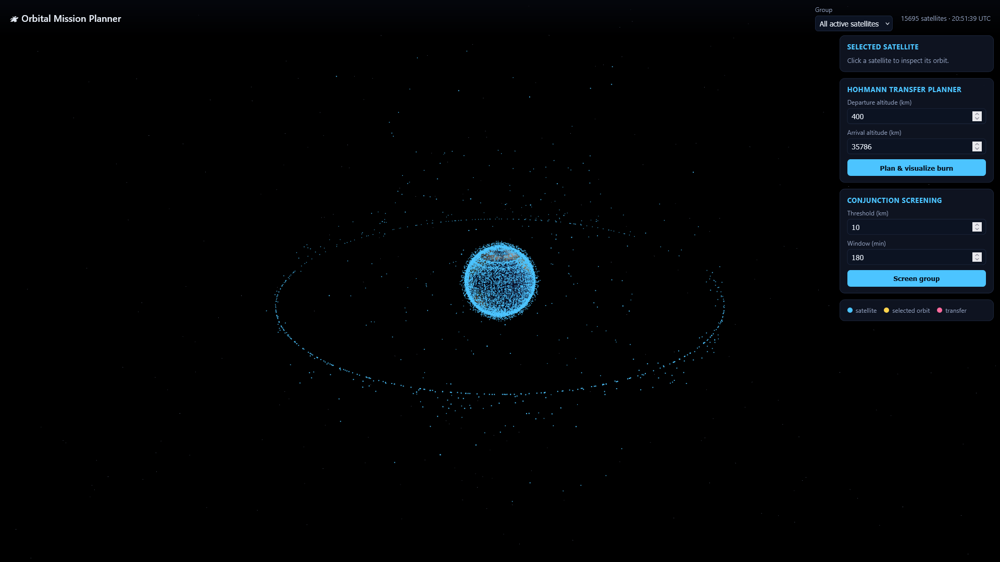

# 🛰 Orbital Mission Planner

*"KSP for real satellites."* A 3D mission planner that propagates real
satellites from live TLE data, screens for close approaches, and plans orbital
transfers — built on a C++ orbital-mechanics core.

Demo Video: https://youtu.be/FHj7BJldIsE



## What it does

- **Live satellites** — fetches TLEs from [CelesTrak](https://celestrak.org) and
  propagates them with **SGP4**, validated against the reference `sgp4` library
  to sub-millimetre accuracy.
- **Click a satellite** → see its full orbit drawn in 3D plus its classical
  orbital elements (apogee, perigee, inclination, eccentricity, RAAN).
- **Conjunction screening** — finds satellite pairs that pass within a chosen
  distance over a time window.
- **Hohmann transfer planner** — compute Δv and timing for a two-burn transfer
  between two circular orbits and visualize the transfer ellipse + burn points.

## Architecture

```
┌─────────────────┐   pybind11   ┌──────────────────┐   REST/JSON  ┌────────────────┐
│  C++ core        │ ───────────▶ │  Flask backend   │ ───────────▶ │  Three.js UI   │
│  (omp_core)      │              │  (REST API)      │              │  (3D Earth)    │
│                  │              │                  │              │                │
│ • two-body RK4   │              │ • TLE fetch/cache│              │ • live sats    │
│ • SGP4 + TLE     │              │ • ground tracks  │              │ • orbit on tap │
│ • Hohmann        │              │ • conjunctions   │              │ • transfer viz │
│ • ECI↔geodetic   │              │ • transfer plan  │              │                │
└─────────────────┘              └──────────────────┘              └────────────────┘
```

| Layer | Path | Tech |
|-------|------|------|
| Core  | [`core/`](core/) | C++17, pybind11. Propagators + orbital mechanics. |
| Backend | [`backend/`](backend/) | Python/Flask. REST API over the core. |
| Frontend | [`frontend/`](frontend/) | Three.js (ES modules via CDN). |

## Prerequisites

- **Python 3.9+** and a **C++17 compiler** (MSVC on Windows, or gcc/clang).
- A modern browser. Node is *not* required — Three.js loads from a CDN.

## Quick start (Windows)

```cmd
run.bat
```

This creates the venv, builds the C++ core, installs deps, and launches the
server. Then open <http://127.0.0.1:5000>. For a manual setup, read on.

## Setup

```bash
# 1. Create a virtual environment
python -m venv .venv
# Windows:  .venv\Scripts\activate     macOS/Linux:  source .venv/bin/activate

# 2. Build & install the C++ core (compiles the pybind11 extension)
pip install -e core

# 3. Install backend dependencies
pip install -r backend/requirements.txt
```

## Run

```bash
python backend/app.py
```

Then open <http://127.0.0.1:5000>. The backend serves both the API and the
frontend. (No internet? It falls back to a bundled TLE set so the app still
runs — see `backend/tle_source.py`.)

## Verify the core

```bash
python core/tests/test_core.py              # SGP4 reference + two-body + Hohmann
python core/tests/validate_vs_sgp4lib.py    # cross-check vs the `sgp4` package
```

Expected: SGP4 matches the reference to sub-millimetre, two-body closes a full
LEO orbit to < 1 m, LEO→GEO Hohmann Δv ≈ 3.9 km/s.

## REST API

| Method | Endpoint | Purpose |
|--------|----------|---------|
| `GET`  | `/api/groups` | Available CelesTrak groups |
| `GET`  | `/api/satellites?group=stations` | Live positions (ECI + sub-point) |
| `GET`  | `/api/satellite/<id>/orbit?group=` | One-period orbit + elements |
| `GET`  | `/api/satellite/<id>/groundtrack?minutes=95` | Sub-satellite track |
| `POST` | `/api/conjunctions` | Close-approach screening |
| `POST` | `/api/transfer/hohmann` | Hohmann Δv + transfer geometry |

## Notes & limitations

- SGP4 here is the **near-Earth** model. Deep-space (SDP4) lunar/solar
  resonance terms are not modelled; objects with period ≥ 225 min are flagged
  `deep_space` and are only approximate.
- The Earth texture's absolute longitude alignment is tuned visually; satellite
  positions themselves are physically exact (true ECI).
- Coordinates are TEME/ECI throughout; the frontend renders in ECI (Z = north)
  and rotates the Earth by GMST.
